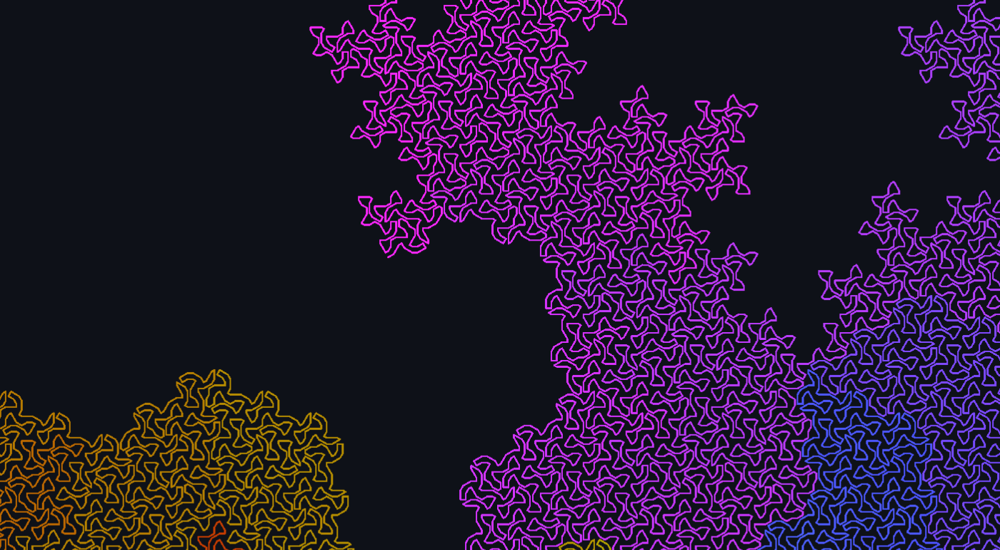
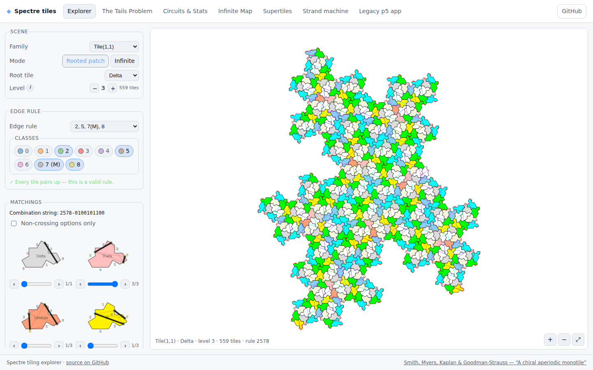
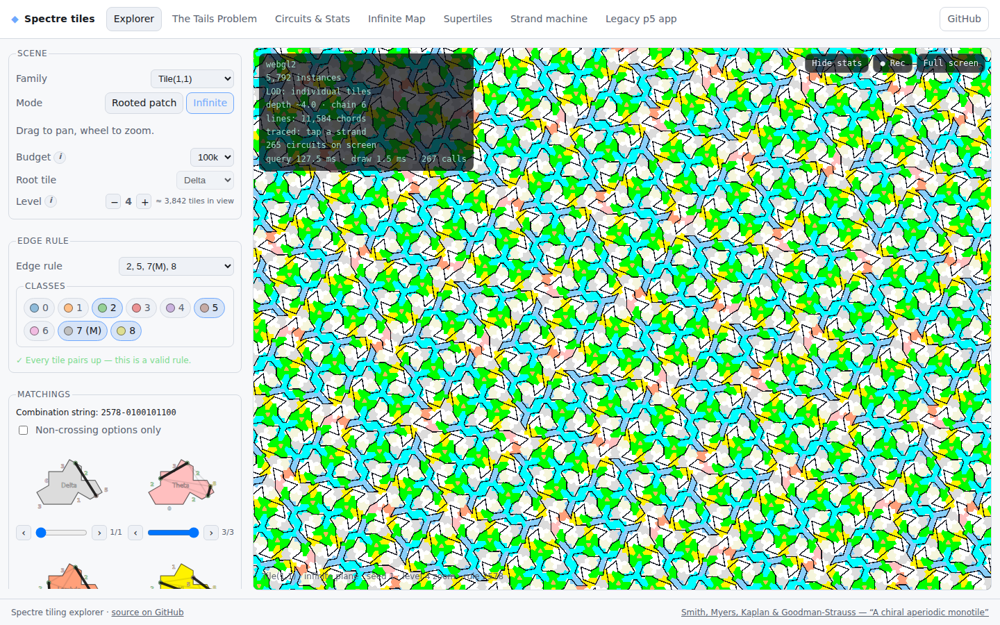
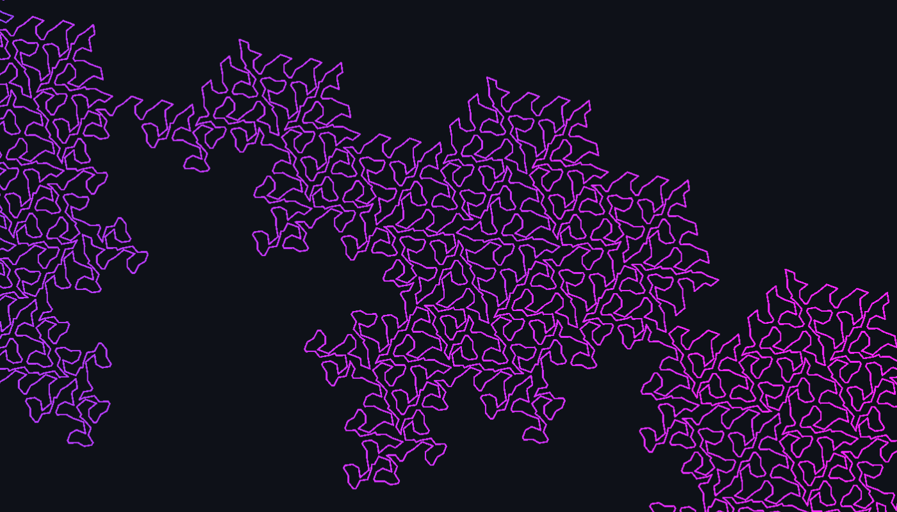
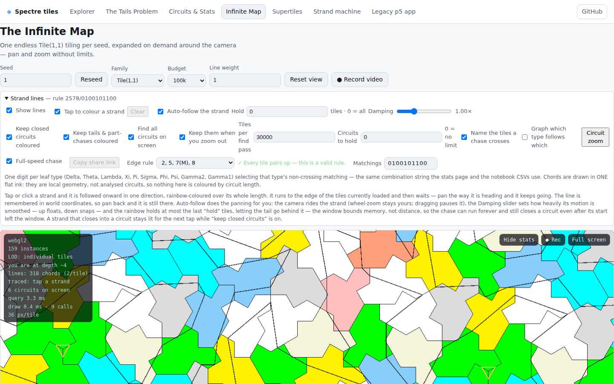
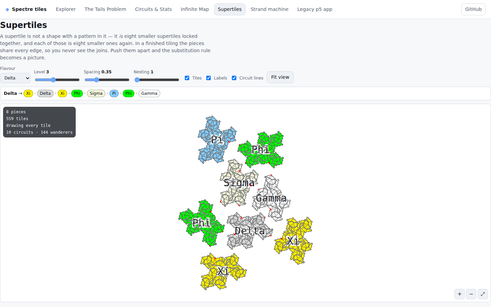
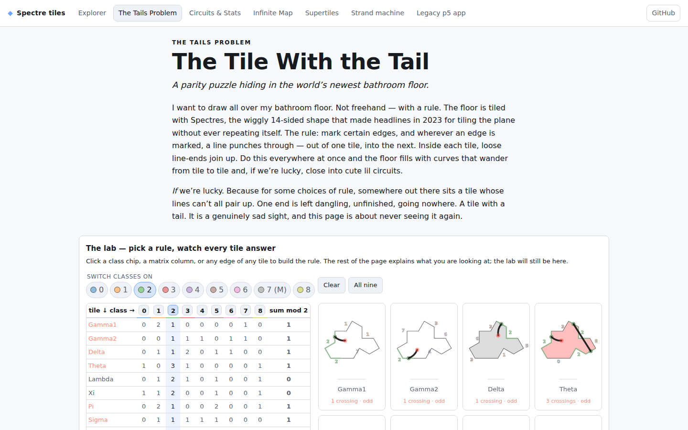
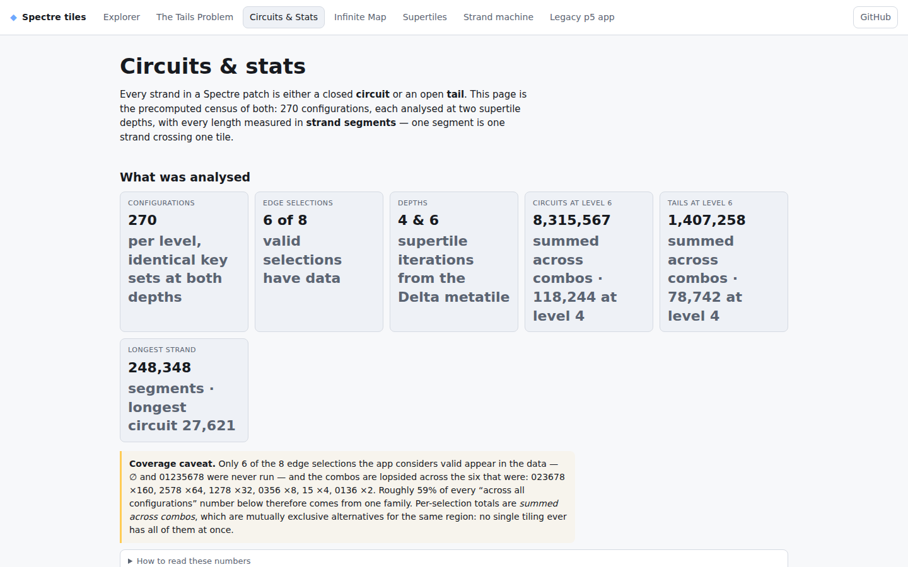
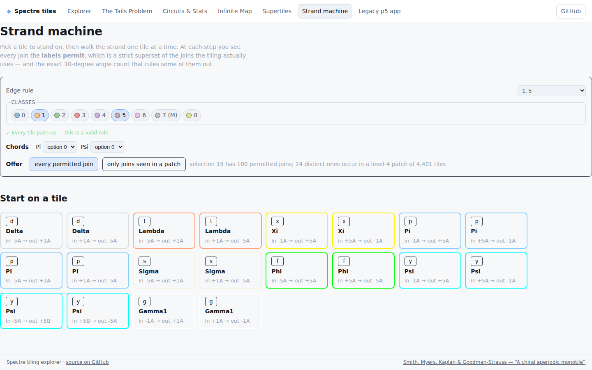

<div align="center">

# Spectre

### Draw on an aperiodic bathroom floor and see where the lines go.

## 👉 [**PLAY IT LIVE: bohemian-miser.github.io/Spectre**](https://bohemian-miser.github.io/Spectre/) 👈

[](https://bohemian-miser.github.io/Spectre/)
[](https://bohemian-miser.github.io/Spectre/map.html)
[](https://bohemian-miser.github.io/Spectre/tails.html)

<a href="https://bohemian-miser.github.io/Spectre/map.html"></a>

<sub>One strand in the <a href="docs/FASS_THEOREM.md">proved infinite line</a> (hexagons, rule <code>128</code>), traced and rainbow-coloured along its length. It never closes, and it never ends.</sub>

</div>

---

The **Spectre** is the 14-sided "chiral aperiodic monotile" found in 2023: one shape that tiles the whole plane, and only ever without repeating. This project draws lines on it. You pick a set of edge classes, a line passes through each of those edges, and every tile joins its incoming lines in pairs. The whole floor then fills with **circuits** (closed loops) and **wanderers** (lines that never close).

It started as mostly vibe coded and plagiarised from Craig Kaplan's [Spectre app](https://cs.uwaterloo.ca/~csk/spectre/app.html) (the original is kept under [`web_orig/`](web_orig/)). Since then it has grown a full React site, an infinite WebGL map, and machine-checked proofs.

## Contents

- [Screenshots](#-screenshots)
- [The rules](#-the-rules)
- [The pages](#-the-pages)
- [Results so far](#-results-so-far)
- [Infrastructure](#-infrastructure)
- [Running it locally](#-running-it-locally)
- [Lingo & TODO](#-lingo)

---

## 📸 Screenshots

<table>
<tr>
<td width="50%"><a href="https://bohemian-miser.github.io/Spectre/#/explorer?v=1&f=spectre&lv=3&e=2578&c=0100101100"></a><br><b>Explorer.</b> Build a supertile, choose the edge rule, and pick how each tile pairs its lines up.</td>
<td width="50%"><a href="https://bohemian-miser.github.io/Spectre/#/explorer?v=1&md=infinite&e=2578&c=0100101100&lv=4"></a><br><b>Infinite mode.</b> Thousands of instanced tiles in WebGL2. Tap a strand to follow it.</td>
</tr>
<tr>
<td><a href="https://bohemian-miser.github.io/Spectre/map.html#/map?seed=1&z=5&ln=1&e=2578&c=0100101100"></a><br><b>Tracing a strand.</b> One line followed across hundreds of Spectres on the Infinite Map.</td>
<td><a href="https://bohemian-miser.github.io/Spectre/map.html#/map?seed=1&z=36&ln=1&e=2578&c=0100101100"></a><br><b>Up close.</b> Zoom in far enough and each tile's chords are visible, plus the controls for seed, family and recording video.</td>
</tr>
<tr>
<td><a href="https://bohemian-miser.github.io/Spectre/supertiles.html#/supertiles?lv=3&gap=0.35&ln=1&e=2578&c=0100101100"></a><br><b>Supertiles.</b> A Delta pulled apart into the eight supertiles it is made of.</td>
<td><a href="https://bohemian-miser.github.io/Spectre/tails.html"></a><br><b>The Tails Problem.</b> An interactive explainer. Toggle the edge classes and watch the tile parities change.</td>
</tr>
<tr>
<td><a href="https://bohemian-miser.github.io/Spectre/stats.html"></a><br><b>Circuits &amp; Stats.</b> A census of 270 configurations: 8.3M circuits, and a longest strand of 248,348 segments.</td>
<td><a href="https://bohemian-miser.github.io/Spectre/machine.html"></a><br><b>Strand machine.</b> Walk a strand by hand, one tile at a time.</td>
</tr>
</table>

---

## 🎲 The rules

> *I want to draw all over my bathroom floor. Not freehand, but with a rule.*
> From [The Tile With the Tail](https://bohemian-miser.github.io/Spectre/tails.html)

**1. The floor.** An endless, non-repeating Spectre tiling. The [aperiodicity proof](https://arxiv.org/abs/2305.17743) sorts tiles into nine roles: Gamma, Delta, Theta, Lambda, Xi, Pi, Sigma, Phi and Psi. Gamma is a pair of Spectres (the "Mystic"), so there are **ten tile types**.

**2. The seams.** Each tile's 14 physical edges group into about six **seams**. A seam is one handshake with a neighbour, and every seam has a **class** from `0` to `8`. A `+3` seam always glues to a `−3` seam next door. Class `7` only occurs inside the Mystic and is labelled `7(M)`.

**3. Pick a rule.** Choose any subset of the classes `{0,…,8}`. Every seam in a chosen class gets exactly **one crossing point**, where a line passes from one tile into the next. Both sides of a seam agree on where the crossing sits. This agreement is the class's *edge contract*.

**4. Play matchmaker.** Inside every tile, join the crossings **in pairs**. Each crossing joins exactly one other crossing: no dead ends, and no three-way junctions. A tile with 4 crossings has 3 ways to pair them, and each tile type picks its pairing independently. The pairings are written as the **combination string** (e.g. `2578-0100101100`, one digit per tile type).

**5. Watch the floor.** Strokes join at the shared crossings and form curves that ignore tile boundaries. Every curve ends up in one of two states:
- 🔁 **Circuit**: it closes into a loop.
- ➰ **Wanderer**: it runs forever, or off the edge of the patch.

**6. Don't grow a tail.** If some tile type ends up with an **odd** number of crossings, one line has nothing to pair with and is left dangling. That is a **tail**, and the rule is broken. Only parity matters, so this is linear algebra over GF(2). Out of 512 possible rules, exactly **8** give every tile an even count:

```
∅   {1,5}   {0,1,3,6}   {0,3,5,6}   {1,2,7,8}   {2,5,7,8}   {0,2,3,6,7,8}   {0,1,2,3,5,6,7,8}
```

These eight rules form a group, (ℤ/2)³, under symmetric difference. Class `4` never appears in any of them. The Explorer marks a rule as valid with *"✓ Every tile pairs up"*.

**The question.** For each valid rule and each choice of pairings, do you get a fixed number of circuits or infinitely many? No infinite line, one, or infinitely many? Which combinations are possible and which are not? The site exists for poking at this, and the [results](#-results-so-far) below answer some of it.

Try it yourself in the [rule lab](https://bohemian-miser.github.io/Spectre/tails.html) before reading the answers. The full write-up is [`docs/EXPLAINER_COPY.md`](docs/EXPLAINER_COPY.md).

---

## 🗺 The pages

| Page | What it does |
|---|---|
| [**Explorer**](https://bohemian-miser.github.io/Spectre/) (`/`) | The main page. Build supertiles, choose which edges join up, and watch the circuits appear. Switch to infinite mode and tap a strand to follow it: the strand is coloured in a rainbow as far as the on-screen tiles reach, and the colouring continues as you pan. |
| [**Infinite Map**](https://bohemian-miser.github.io/Spectre/map.html) | One endless tiling per seed, expanded around the camera. It works for all four tile families: Tile(1,1), Hexagons, Turtles in Hats, and Hats in Turtles (selector or `f=`). Auto-follow rides the traced strand with a stabilised dolly camera and a **Damping** slider. **● Record video** saves the canvas, chase included, to a WebM/MP4 file. |
| [**The Tails Problem**](https://bohemian-miser.github.io/Spectre/tails.html) | An explainer for the edge matching and for why some tiles end up with tails. Includes the rule lab, the parity matrix, the kernel gallery, and the matchmaker sliders. |
| [**Circuits & Stats**](https://bohemian-miser.github.io/Spectre/stats.html) | The census of every analysed edge combination, with the numbers behind it. |
| [**Supertiles**](https://bohemian-miser.github.io/Spectre/supertiles.html) | Pull a supertile apart into its pieces, one substitution at a time. |
| [**Strand machine**](https://bohemian-miser.github.io/Spectre/machine.html) | Walk a strand by hand. At each step it shows the joins the labels permit and the joins the tiling actually uses. |
| [**Legacy app**](https://bohemian-miser.github.io/Spectre/legacy.html) | The original p5 version. You can draw on each of the 10 tile types, change the colours, and it has better navigation. |

Every view's state lives in the URL hash, so any screenshot above links to exactly the state it shows.

---

## 🏆 Results so far

**Selection `15` is finite.** Edge selection `15` has a **fixed, finite** set of circuits and no infinite line at all. Every circuit is a loop of 3, 6 or 9 segments, and up to congruence there are only five distinct circuits across all four of its combinations. Two steps are finite checks rather than theorems and are flagged as such, so read it as a strong conditional result rather than a closed one. Write-up in [`docs/CIRCUITS_15.md`](docs/CIRCUITS_15.md), exact-arithmetic scripts in [`web/sel15-proof/`](web/sel15-proof/), and a Lean 4 check of the combinatorial core in [`lean/`](lean/).

**The infinite line is proved.** Selection `128` on hexagons with combination `010100000`, and selection `1278` on Tile(1,1) with `0101000000`, make the Psi supertile's strands a **single self-avoiding arc through every tile at every level**. Along a chain of nested Psi supertiles that exhausts the plane, those arcs grow at both ends into one bi-infinite curve. The proof is the substitution argument sketched below, made exact. Every supertile is a combinatorial hexagon whose six edges compose from its children's edges by a fixed table, so the strand routing is a fixed operator. Non-overlap of the pieces at every level comes from a covering-space argument rather than a per-level check. Write-up in [`docs/FASS_THEOREM.md`](docs/FASS_THEOREM.md), scripts in [`web/fass-theorem/`](web/fass-theorem/), and the combinatorial core machine-checked in Lean 4 in [`lean/FASS/`](lean/FASS/). The earlier proof plan and evidence dossier are [`docs/FASS_PROOF.md`](docs/FASS_PROOF.md) and [`docs/FASS_1278.md`](docs/FASS_1278.md).

The original intuition, kept for the record: *I'm pretty sure I can make either an infinite line but haven't got a solid proof yet. I think I'd need to rework the generator to do a kind of substitution thing instead of the standard spectre algorithm and then I could show that you make a long line/circuit, and when you substitue all the tiles for the next superset you maintain all the paths (like a standard infinite line proof, like the hilbert curve).*

I plan on bringing in more of the edge work from my [blog](https://substack.com/@theharderthanobsidiantower/p-156511066).

---

## 🏗 Infrastructure

```
                 ┌──────────────────────────── GitHub ────────────────────────────┐
  pull request ─▶│ ci.yml: typecheck (site) → vitest → vite build                 │
                 │         + Playwright e2e against `vite preview`                │
  push to main ─▶│ static.yml: npm install → vite build → deploy web/dist → Pages  │──▶ bohemian-miser.github.io/Spectre
                 └────────────────────────────────────────────────────────────────┘
```

### The site ([`web/`](web/))

| Concern | Choice |
|---|---|
| Framework | **React 18 + TypeScript 5**, bundled by **Vite 7** as a multi-page app. Each page is its own HTML entry (`index`, `map`, `tails`, `stats`, `supertiles`, `machine`, `legacy`, `widgets`) with base `/Spectre/`. |
| Rendering | **SVG** for patches and widgets, which gives per-edge hover and crisp export. **WebGL2 instanced** rendering with a Canvas2D fallback for the infinite map, with level-of-detail glyphs once tiles become sub-pixel. |
| Compute | A pure, DOM-free **core library** ([`web/src/core/`](web/src/core/)) for geometry, tile systems, matchings, circuit tracing, GF(2) subsets and exact arithmetic. It runs unchanged inside **Web Workers** ([`web/src/workers/`](web/src/workers/)) for tiling generation and circuit analysis. |
| State | One reducer per page, mirrored into the **URL hash**, so every view can be shared as a link. |
| Tests | **Vitest** unit tests next to the code (`__tests__/`) and **Playwright** end-to-end specs in [`web/tests/`](web/tests/). |
| Legacy | The original **p5.js** app is kept in its own chunk and loaded only by `legacy.html`. |

The design doc with the full layering rules is [`docs/DESIGN.md`](docs/DESIGN.md).

### Maths & proofs

| Where | What |
|---|---|
| [`web/fass-theorem/`](web/fass-theorem/), [`web/fass-proof/`](web/fass-proof/), [`web/sel15-proof/`](web/sel15-proof/) | Exact-arithmetic TypeScript scripts that build the substitution tables and certificates. |
| [`lean/`](lean/) | **Lean 4** (`v4.15.0`, no Mathlib): the `Sel15` and `FASS` libraries, kernel-checked with no `sorry` and no `native_decide`. |
| [`isabelle/`](isabelle/) | An Isabelle/HOL twin of the FASS core (not yet built). |
| [`graph_analysis/`](graph_analysis/), [`Spectre_Patterns.ipynb`](Spectre_Patterns.ipynb) | The level-4/level-6 circuit census CSVs and the notebook that produced them. They feed the Stats page. |
| [`docs/`](docs/) | Write-ups for the theorems, the explainer copy, and the investigations. |

---

## 🛠 Running it locally

```bash
cd web
npm install
npm run dev          # http://localhost:8081/Spectre/
npm test             # vitest unit tests
npm run typecheck:site
npm run build && npm run preview   # serve the production build
npx playwright test  # e2e, with preview running
```

The build needs the `/Spectre/` base path, so a plain static server at the root won't find the assets. Use `npm run preview`.

To check the proofs:

```bash
cd lean && lake build   # Sel15 in under a minute. FASS is heavy: ~13 min and ~9 GB per config file.
```

---

## 📖 Lingo

* **Thumbs**: the editable tiles at the top of the page. Short for "thumbnails".
* **Seam**: one handshake between two tiles, made of one or more physical edges.
* **Class**: the number `0`–`8` on a seam. The edge rule picks classes.
* **Combination string**: e.g. `2578-0100101100`, the rule followed by one pairing digit per tile type.
* **Circuit / wanderer / tail**: a closed loop, an open strand, and a crossing with nothing to pair with.

## ✅ TODO

* Do everything in shaders so it's nippy af.
* Click on a tile to bring up a large drawable window instead of having all of them at the top all the time.
* Put labels on the thumbnail boxes.
* Remove the duplicate Gamma colour boxes.
* Clean up the ui .. a lot.
* Make quads, ids, and edge dots off by default.
* Make 'Show all edge numbers' only turn on/off the edge labels, not the joiner edges.
* Add another checkbox for all joiner edges and put it with the joiner edges text.
* Fix hexagons and 0-edges; they don't need the same treatment as the other shapes.
* Colour choice for lines.
* Download a template, edit as svg and re-upload.
* Analysis time in bottom.
* Graph showing the lines between thumbs.

---

<div align="center">

**[▶ Go play with it](https://bohemian-miser.github.io/Spectre/)**

Built on Smith, Myers, Kaplan & Goodman-Strauss, [*A chiral aperiodic monotile*](https://arxiv.org/abs/2305.17743), and Craig Kaplan's [Spectre app](https://cs.uwaterloo.ca/~csk/spectre/). BSD 3-Clause, see [LICENSE](LICENSE).

</div>
